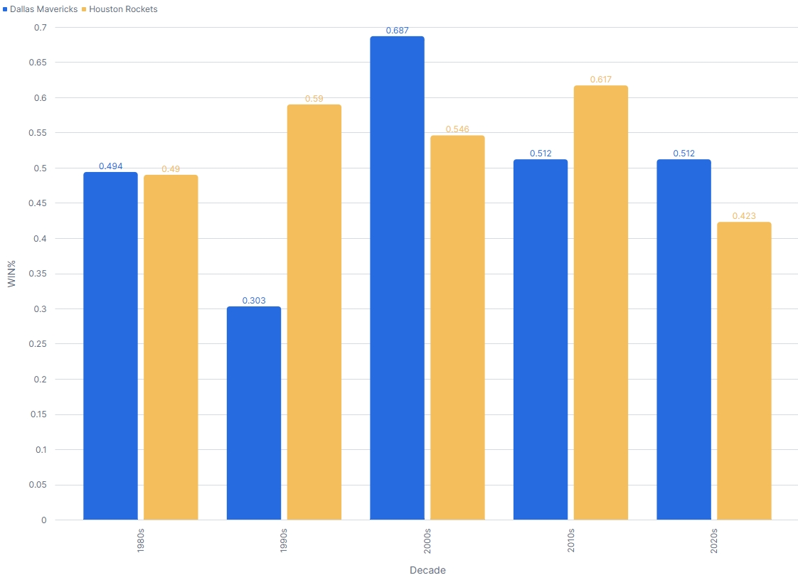
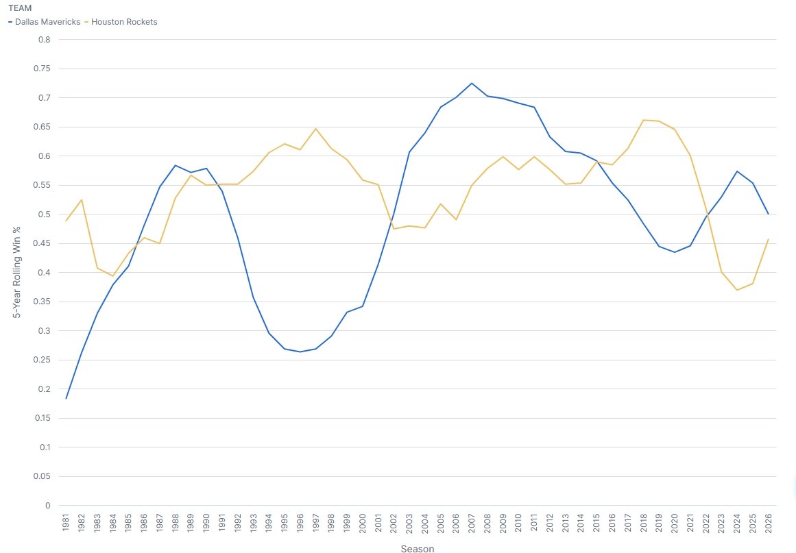

# Mavericks vs. Rockets: Which Franchise Has Been Better?

**Tools:** Snowflake, SQL (window functions, CTEs, views, QUALIFY), Snowsight charts
**Author:** Charles Esters III

## The Question

Dallas and Houston fans have argued about this rivalry for decades. I wanted to answer it with data instead of opinion: **since both franchises have existed, which one has been more successful, and has that changed over time?**

The approach is the same one a business analyst would use to benchmark two stores, regions, or vendors: validate the data, compare performance on several measures, and break results into time periods to see what drives the difference.

## Data

- **Source:** Basketball-Reference franchise histories, one row per team per season, with Houston's 2019-20 through 2025-26 records confirmed from season summaries.
- **Coverage:** Rockets from 1967-68 (as the San Diego Rockets through 1970-71), Mavericks from 1980-81, both through 2025-26.
- **Fields:** season, wins, losses, playoff result, and SRS (Simple Rating System: point differential adjusted for schedule strength, where 0 is an average team).

**Validation:** Before analyzing anything, I checked my Mavericks totals against the official franchise record (1862-1845, 25 playoff appearances, 1 title) and they matched exactly.

## Method

1. Built a Snowflake warehouse, database, and schema, with auto-suspend to control compute costs.
2. Created a lookup table for playoff results and joined it to the season data (a normalized design).
3. Built a view that calculates win percentage, decade, and playoff flags once, so every query uses the same logic.
4. Limited the main comparison to **1980-81 onward**, the years both teams existed. Including Houston's first 13 seasons (a .435 win percentage) would have been an unfair comparison.
5. Used **win percentage instead of raw wins**, because the 1999, 2012, 2020, and 2021 seasons were shortened.

## Key Findings

### 1. Houston has been the better franchise overall

| Since 1980-81 | Mavericks | Rockets |
|---|---|---|
| Record | 1862-1845 (.502) | 2009-1695 (.542) |
| Playoff appearances | 25 | 31 |
| Conference finals | 6 | 7 |
| NBA Finals | 3 | 4 |
| Championships | 1 (2011) | 2 (1994, 1995) |
| Seasons with the better record | 21 | 25 |

### 2. But the lead has changed hands by era

| Decade | Winner | Story |
|---|---|---|
| 1980s | Even | Both teams near .490 |
| 1990s | Houston, by a lot | Rockets .590 with two titles; Mavericks .303 with no playoff trips |
| 2000s | Dallas | Mavericks .687 in the Dirk Nowitzki era |
| 2010s | Houston | Rockets .617 in the James Harden era |
| 2020s so far | Dallas, narrowly | Mavericks .512 vs. Rockets .423, though Houston is now rising |

Each swing lines up with a franchise player: Hakeem Olajuwon, then Dirk Nowitzki, then James Harden.

### 3. Dallas had the most sustained run

Dallas made the playoffs 12 straight seasons (2001-2012), the longest streak by either team. Houston's longest was 8 (2013-2020).

### 4. The 5-year trend shows each handoff

The lines cross roughly five times over 45 years. At the far right, Dallas is falling and Houston is rising, and another crossover appears to be coming.

**A limitation worth noting:** In 2025-26, Houston went 52-30 while Dallas went 26-56, yet Dallas's rolling average is still higher (about .500 vs. .456). The 5-year window still includes Houston's rebuild seasons and Dallas's playoff runs. Rolling averages are good for long-term trends but slow to reflect sudden changes, so current strength is better judged from the latest season alone.

## Limitations

- SRS is missing for Houston's last seven seasons, so the peak-season comparison (Q5) excludes those years.
- The data is season-level, so it shows *what* happened but not *why* (roster, payroll, coaching). Player-level data would be a natural next step.
- The playoff scoring used in the decade comparison weights a title extra; this is a judgment call, and the overall conclusion doesn't depend on it.

## SQL Techniques Used

| Technique | Where | Business use |
|---|---|---|
| Lookup table and JOIN | `playoff_rounds` | Normalized design, like product or region tables |
| View | `season_view` | One definition of each metric shared by all queries |
| `RANK()` with `PARTITION BY` | Q2 | Ranking within groups (top region per quarter) |
| CTE and self-join | Q3 | Side-by-side comparisons of two entities |
| Gaps and islands | Q4 | Consecutive streaks (months of growth, active subscriptions) |
| `QUALIFY` with `ROW_NUMBER()` | Q5 | Top N per group (top products per category) |
| Rolling window frame | Q6 | Moving averages for trend reporting |
| `STDDEV` | Q7 | Consistency and risk comparison |

## How to Run

1. Open a Snowflake worksheet and paste in `mavs_vs_rockets_snowflake.sql`.
2. Select all and use **Run All** to build the tables and view.
3. Run any single query by clicking inside it and pressing Ctrl+Enter (Cmd+Enter on Mac).
4. When returning in a new session, first run `USE WAREHOUSE nba_wh; USE DATABASE texas_nba; USE SCHEMA analysis;`
